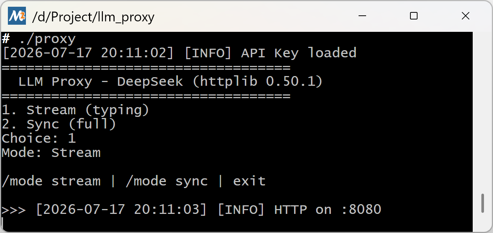

# LLM Proxy

C++ 实现的 LLM 请求转发代理，支持并发 + SSE 流式输出。

## 技术栈

- **后端**：C++14、[cpp-httplib](https://github.com/yhirose/cpp-httplib) 0.50.1、[nlohmann/json](https://github.com/nlohmann/json)、OpenSSL、线程池
- **前端**：Vite + React 19 + TypeScript + Tailwind CSS 4
- **API**：DeepSeek（deepseek-v4-pro，启用 thinking）+ allama


### 1. 编译后端

#### CMake

```bash
# MSYS2 MinGW64 终端中（OpenSSL 已通过 pacman 安装）
cmake -B build -G "Unix Makefiles"
cmake --build build
```


输出：`build/proxy.exe`

### 2. 设置 API Key

```powershell
$env:DEEPSEEK_API_KEY = "sk-your-key-here"
```

### 3. 启动后端

```bash
./proxy.exe
```

选择模式 `1`（Stream），服务器监听 `http://localhost:8080`。

终端内可直接输入消息与 DeepSeek 对话：

```
>>> 你好
Assistant: 你好！有什么可以帮你的？
```

- 输入 `/mode stream` 切换流式模式
- 输入 `/mode sync` 切换同步模式
- 输入 `exit` 退出



### 4. 启动前端（可选）

```bash
cd frontend
npm install
npm run dev
```

浏览器打开 `http://localhost:5173`，通过图形界面与 LLM 对话。


 支持模型切换。


### 5. Docker 部署（一键启动）

```bash
# 设置 API Key
export DEEPSEEK_API_KEY="sk-your-key-here"

# 构建并启动
docker compose up -d

# 浏览器打开 http://localhost:5173
```

架构：前端 nginx（:5173）→ 反向代理 `/chat` → 后端 proxy（:8080）→ DeepSeek API。

## API 接口

### POST `/chat/stream`（SSE 流式）

请求：
```json
{ "prompt": "你好" }
```

响应（`text/event-stream`）：
```
data: {"delta":{"reasoning_content":"思考过程…","content":"正式回复…"}}

data: [DONE]
```

- `delta.reasoning_content`：思维链（推理过程）
- `delta.content`：正式回复内容
- `[DONE]`：流结束

### POST `/chat`（同步）

请求：
```json
{ "prompt": "你好" }
```

响应：
```json
{ "reply": "完整回复内容" }
```

### GET `/`

健康检查，返回 `LLM Proxy (httplib 0.50.1, SSE OK)`。

## 项目结构

```
├── src/main.cpp              # 后端主程序（跨平台 C++14）
├── include/
│   ├── httplib.h             # cpp-httplib（header-only）
│   └── json.hpp              # nlohmann/json（header-only）
├── CMakeLists.txt            # CMake 构建配置
├── Dockerfile                # 多阶段 Docker 构建
├── docker-compose.yml        # 一键部署编排
├── frontend/                 # React 前端
│   ├── nginx.conf            # Docker 部署用 nginx 配置
│   └── src/
│       ├── hooks/
│       │   ├── useSSE.ts           # SSE 流式消费
│       │   └── useConversations.ts # 多轮对话管理
│       └── components/
│           ├── ChatWindow.tsx      # 聊天窗口
│           ├── Sidebar.tsx         # 侧边栏
│           └── ReasoningBlock.tsx  # 思维链展示
└── README.md
```

## 待优化

- [ ] Token 限流
- [ ] 请求重试 + 熔断
